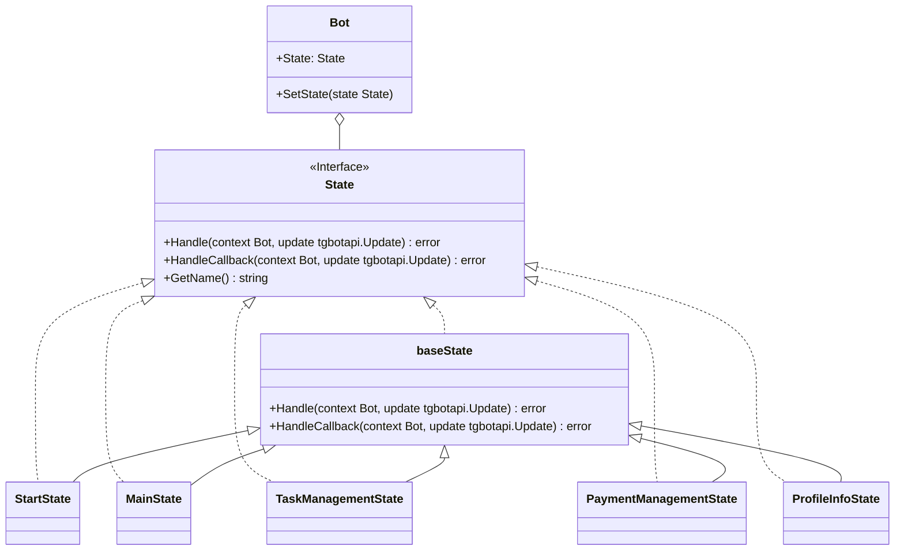

```mermaid
classDiagram
    direction TB

    class Bot {
        +State: State
        +SetState(state State)
    }

    class State {
        <<Interface>>
        +Handle(context Bot, update tgbotapi.Update) error
        +HandleCallback(context Bot, update tgbotapi.Update) error
        +GetName() string
    }

    class baseState {
        +Handle(context Bot, update tgbotapi.Update) error
        +HandleCallback(context Bot, update tgbotapi.Update) error
    }

    class StartState {
    }

    class MainState {
    }

    class TaskManagementState {
    }
    
    class PaymentManagementState {
    }

    class ProfileInfoState {
    }

    Bot o-- State
    
    State <|.. baseState
    State <|.. StartState
    State <|.. MainState
    State <|.. TaskManagementState
    State <|.. PaymentManagementState
    State <|.. ProfileInfoState

    baseState <|-- StartState
    baseState <|-- MainState
    baseState <|-- TaskManagementState
    baseState <|-- PaymentManagementState
    baseState <|-- ProfileInfoState
```