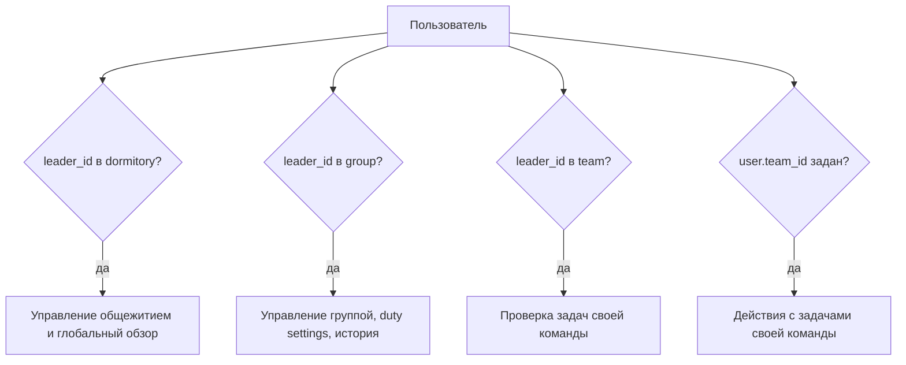

# Авторизация и полномочия

## Аутентификация

Backend использует cookie `resident_session`.

- логин: `POST /api/v1/auth/login`
- logout: `POST /api/v1/auth/logout`
- текущий пользователь: `GET /api/v1/auth/me`

Cookie подписывается HMAC-SHA256 от `userID|expiresAt`. Источник секрета:

1. `AUTH_SECRET`
2. fallback на `DB_PASSWORD`
3. dev fallback `dev-auth-secret`

## Базовые отношения

Права выводятся из текущих связей, а не из отдельной роли:

- глава общежития: `dormitory.leader_id == currentUser.id`
- глава группы: `group.leader_id == currentUser.id`
- глава команды: `team.leader_id == currentUser.id`
- участник команды: `user.team_id == team.id`

Один пользователь может одновременно быть:

- главой общежития;
- главой группы;
- главой команды;
- обычным участником своей команды.

## Модель прав

## Фактические permission rules

| Действие | Кто может |
| --- | --- |
| Логин в resident app | любой пользователь с валидным `login/password_hash` |
| Просмотр текущего дежурства своей группы | житель, у которого есть доступ к группе через текущее членство или лидерство |
| Выбор любой группы/общежития | только глава общежития |
| Просмотр истории дежурств группы | только глава этой группы |
| Просмотр деталей старого дежурства | только глава доступной группы |
| Взять/вернуть/завершить задачу | участник команды этого дежурства, пока дежурство активно или пока у прошедшего дежурства есть незакрытые задачи |
| Подтвердить/переоткрыть задачу | только глава команды текущего `duty.team_id` |
| Создать дежурство группы вручную | только глава группы |
| Менять duty settings группы | только глава группы |
| Управлять общежитиями, группами, жителями, территориями, каталогом задач | только глава любого общежития |
| Управлять предупреждениями | глава общежития в пределах своего общежития; иначе глава группы в пределах своих групп |
| Управлять складом общежития | глава общежития своего текущего общежития; иначе глава группы своего текущего общежития |

## Особенности resident access model

`resident.Service` сначала строит `residentAccessContext`:

- обычный житель привязан к своей группе через текущее `team_id`;
- глава команды, если `team_id` у него отсутствует, всё равно может быть распознан по `team.leader_id`;
- глава группы без команды имеет доступ к своей группе;
- глава общежития может выбрать любую группу внутри выбранного общежития, а также другой `dormitory_id`.

Frontend лишь показывает поля:

- `can_manage_dormitories`
- `can_manage_penalties`
- `can_manage_warehouse`
- `can_manage_tasks`
- `can_manage_duty_settings`

Источником истины для этих флагов остаётся backend.

## Важные ограничения

- Нет общего RBAC и нет таблицы `role`.
- Права вычисляются по текущим связям, поэтому их изменение сразу влияет на доступ.
- Для истории дежурств используется текущее лидерство группы/команды, а не снапшот полномочий на прошлую дату.
