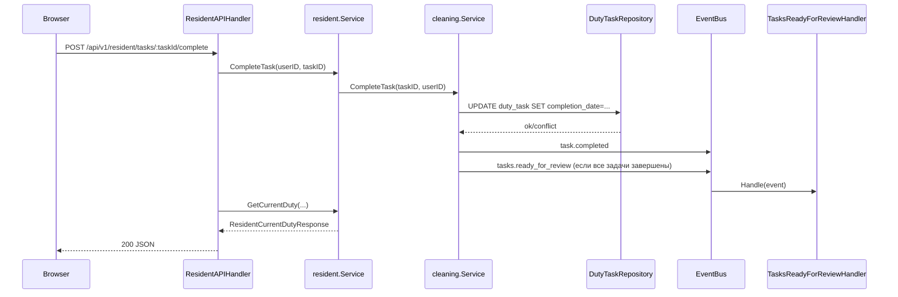

# Backend

## Общая модель

Backend реализован как практическая гексагональная схема:

- `pkg/core/domain` хранит сущности и инварианты;
- `pkg/core/ports` описывает интерфейсы use-case и DTO;
- `pkg/core/usecase` реализует бизнес-сценарии;
- `pkg/adapters/http` принимает HTTP и маппит его в use-case;
- `pkg/infrastructure/mysql` реализует хранилище;
- `pkg/infrastructure/di` собирает контейнер;
- `pkg/infrastructure/scheduler` запускает фоновые сценарии;
- `pkg/infrastructure/eventbus` связывает use-case и внешние эффекты без прямой зависимости.

## Направление зависимостей

- `domain` не знает про HTTP, MySQL, cron и browser push.
- `ports` знают только про контракты.
- `usecase` зависит от `domain` и `ports`.
- `adapters/http` зависит от `ports` и конкретных use-case интерфейсов.
- `infrastructure` зависит от core-слоёв, но не наоборот.

## Слои

### `pkg/core/domain`

Содержит:

- `catalog`: `Area`, `TaskDefinition`, `DutyTaskOverride`;
- `duty`: `Duty`, `DutyTask`, переходы состояний и ошибки;
- `structure`: `Dormitory`, `Group`, `Team`;
- `user`: `User`;
- `penalty`: `Penalty`;
- `notification`: `Notification`, `PushSubscription`, `NotificationType`.

Здесь должны жить инварианты и допустимые переходы. Здесь не должно быть SQL, HTTP-статусов и сериализации API.

### `pkg/core/ports`

Содержит:

- use-case интерфейсы (`CleaningUseCase`, `ResidentDutyUseCase`, `PenaltyUseCase` и т. д.);
- DTO для HTTP/frontend;
- query-service интерфейсы для read-моделей;
- event bus и push sender контракты.

### `pkg/core/usecase`

Ключевые сервисы:

- `cleaning.Service`: создание дежурств и действия с `DutyTask`;
- `resident.Service`: формирование resident view текущего дежурства и истории;
- `dutysettings.Service`: настройки группы, команд, территорий и задач;
- `penalty.Service`: warnings/penalties и scope доступа;
- `notification.*`: подписки, хранение уведомлений и reminder-сценарии;
- `user.Service`, `dormitory.Service`, `team.Service`, `catalog.Service`: CRUD и вспомогательные сценарии.

Use-case слой не должен содержать SQL или прямую работу с Fiber.

### `pkg/adapters/http`

HTTP-адаптеры регистрируются в `pkg/infrastructure/di/container.go`.

Актуальные группы маршрутов:

- `/api/v1/auth`
- `/api/v1/resident`
- `/api/v1/notifications`
- `/api/v1/penalties`
- `/api/v1/dormitories`
- `/api/v1/groups`
- `/api/v1/teams`
- `/api/v1/areas`
- `/api/v1/task-definitions`
- `/api/v1/users`

Роль handler-ов:

- прочитать cookie и параметры;
- распарсить body;
- вызвать use-case;
- вернуть JSON и HTTP-код.

Бизнес-решения о правах и инвариантах остаются в use-case и домене.

### `pkg/infrastructure/mysql`

Содержит:

- `repository/*`: write/read для доменных агрегатов;
- `query/*`: read-модели для списков, истории и уведомлений;
- `connection.go`: SQL connection pool.

Особенно важные детали:

- UUID сериализуются как `BINARY(16)`;
- soft delete есть у `user` и `task`;
- создание `duty` выполняется в транзакции с блокировкой группы и проверкой пересечения периода.

### `pkg/infrastructure/di`

`NewContainer` собирает:

- подключение к БД;
- репозитории и query services;
- use-case сервисы;
- event bus;
- scheduler;
- Fiber app.

Это единственная точка композиции runtime.

### Scheduler и event bus

- `scheduler.Scheduler` читает cron из `config.json` и TZ из env.
- `StartNewWeek` вызывается по cron.
- notification reminder jobs включаются только при `NOTIFICATION_SCHEDULER_ENABLED=true`.
- `cleaning.Service` публикует события:
  - `week.started`
  - `task.assigned`
  - `task.completed`
  - `tasks.ready_for_review`
- сейчас на bus подписаны только notification handlers.

### Web Push infrastructure

- `notification.DeliveryService` всегда создаёт запись `notification` в БД.
- При `WEB_PUSH_ENABLED=true` сервис ищет `push_subscription` пользователя и отправляет payload через `webpush-go`.
- Просроченные подписки (`410/404`) удаляются из БД автоматически.

## Реальный сценарий: житель завершает задачу

## Что сюда не помещать

- frontend navigation;
- browser-only permission checks;
- ad hoc SQL в handler-ах;
- прямые вызовы push/web API из use-case кроме через порты;
- доменную логику в DTO.
