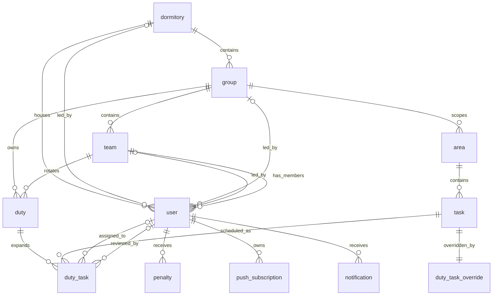

# База данных

## Источник истины

Этот документ основан на актуальной цепочке миграций в `data/mysql/migrations/`.

## Общие правила

- UUID хранятся как `BINARY(16)`.
- Основные текстовые таблицы используют `utf8mb4`.
- История дежурств не снапшотит `user`, `team`, `task`, `area`: старые записи продолжают ссылаться на текущие mutable сущности.
- Soft delete используется в таблицах `user.deleted_at` и `task.deleted_at`.

## Основные таблицы

### `dormitory`

- `id` `INT UNSIGNED AUTO_INCREMENT`
- `leader_id` `BINARY(16) NULL`
- адресные поля: `name`, `city`, `street_type`, `street_name`, `house_number`

### `group`

- `id` `BINARY(16)`
- `leader_id` `BINARY(16) NULL`
- `name`
- `dormitory_id`

Колонка `next_duty_team` была удалена миграцией `1769165378`.

### `team`

- `id` `BINARY(16)`
- `group_id`
- `leader_id NULL`
- `name`
- `color NULL`
- `rotation_position INT NOT NULL`

Ограничения:

- `UNIQUE (group_id, rotation_position)` — текущая модель ротации.
- `idx_team_group_rotation (group_id, rotation_position)`

### `user`

- `id` `BINARY(16)`
- `login`, `password_hash`
- `first_name`, `middle_name NULL`, `last_name`
- `team_id NULL`
- `floor_number NULL`, `room_number NULL`
- `dormitory_id NULL`
- `created_at`
- `deleted_at NULL`

Отдельного `role_id` больше нет.

### `area`

- `id` `INT UNSIGNED AUTO_INCREMENT`
- `name`
- `floor`
- `group_id NULL`

`group_id IS NULL` означает общую территорию, доступную для round-robin распределения между группами.

### `task`

- `id` `BINARY(16)`
- `area_id`
- `title`
- `cost`
- `recurrence_interval`
- `start_sequence`
- `deleted_at NULL`

Ограничения:

- `CHECK recurrence_interval >= 0`

Актуальная recurrence-модель sequence-based, а не calendar-based.

### `duty`

- `id` `BINARY(16)`
- `team_id`
- `group_id`
- `start_date`
- `end_date`
- `sequence_number`

Ограничения и индексы:

- `UNIQUE (group_id, sequence_number)` как `uq_duty_group_sequence`
- `idx_duty_group_period (group_id, start_date, end_date)`
- `idx_duty_team_sequence (team_id, sequence_number)`

`sequence_number` уникален только внутри группы.

### `duty_task`

- `id` `BINARY(16)`
- `duty_id`
- `task_id`
- `assignee_id NULL`
- `reviewer_id NULL`
- `assignment_date NULL`
- `completion_date NULL`
- `verification_date NULL`

Ограничения:

- `UNIQUE (duty_id, task_id)`

### `duty_task_override`

- `task_id`
- `include_in_next_duty BOOLEAN`

Это одноразовая настройка ближайшего включения/исключения задачи.

### `penalty`

- `id`
- `user_id`
- `weight DECIMAL(10,1)`
- `reason VARCHAR(256)`
- `issued_on DATE`
- `created_at`
- `resolved_at NULL`

Индекс:

- `idx_penalty_user_resolved (user_id, resolved_at)`

### `push_subscription`

- `id`
- `user_id`
- `endpoint TEXT`
- `endpoint_hash BINARY(32)`
- `p256dh`
- `auth_secret`
- `user_agent NULL`
- `created_at`, `updated_at`

Ограничения:

- `UNIQUE endpoint_hash`
- индекс по `user_id`

### `notification`

- `id`
- `user_id`
- `type`
- `title`
- `body`
- `target_url`
- `deduplication_key`
- `created_at`
- `read_at NULL`

Ограничения:

- `UNIQUE (user_id, deduplication_key)` — deduplication на пользователя и доменный ключ.
- индекс `idx_notification_user_created (user_id, created_at)`

## ER-модель

## Историчность и последствия

- `duty` и `duty_task` историчны сами по себе.
- Но имя команды, глава команды, название задачи и территория берутся из текущих таблиц при чтении. Например, `FindHistoryByGroupID` джоинит текущего `team.leader_id` и текущую `task.cost`.
- Это значит, что история отображает текущие связанные сущности, а не снапшот на момент создания дежурства.

Практическое следствие: изменение главы команды или soft delete задачи может менять то, как прошлые дежурства видны в UI.

## Транзакционные ограничения

Создание `duty` в `repository/duty.go` делает:

1. `BEGIN`
2. определение `group_id` по `team_id`
3. `SELECT ... FOR UPDATE` по группе
4. проверку пересечения периода
5. insert `duty`
6. insert `duty_task`
7. `COMMIT`

Пересечение проверяется как полуоткрытый интервал:

- конфликт есть, если существующее `start_date < new_end`
- и существующее `end_date > new_start`

То есть два дежурства могут соприкасаться по границе без overlap, если одно заканчивается ровно в момент начала другого.
