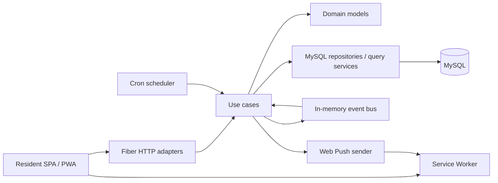

# Обзор системы

## Назначение

`dorm` автоматизирует недельные дежурства:

- хранит общежития, группы, команды, жителей, территории и каталог задач;
- формирует дежурства по группам и ротации команд;
- позволяет жителям брать, выполнять и подтверждать задачи через web-приложение;
- даёт руководителям группы доступ к истории дежурств, настройкам состава команд и каталога задач;
- даёт главе общежития доступ к управлению структурой и жителями;
- ведёт предупреждения (`penalty`) и web push-уведомления.

## Главные сценарии

1. Житель логинится в `/app/login`, получает cookie-сессию и открывает текущее дежурство.
2. Участник дежурной команды берёт задачу, завершает её, а глава команды подтверждает или возвращает в работу.
3. Глава группы вручную создаёт дежурство для своей группы или настраивает команды, территории и задачи.
4. Планировщик запускает новое недельное дежурство и напоминания.
5. Сервис сохраняет уведомление в БД и, если Web Push включён, отправляет push-пакет в браузер.

## Основные части

- Backend: Fiber HTTP API, use-case слой и MySQL-репозитории.
- Frontend: React/Vite PWA под `/app`.
- База данных: MySQL 8, миграции через `golang-migrate`.
- Scheduler: cron-задачи для запуска дежурств и reminder-уведомлений.
- Notifications: доменные уведомления + Web Push инфраструктура.

## Архитектурные границы

## Внешние границы

- HTTP boundary: `/api/v1/**` и статическая выдача `/app/**`.
- Storage boundary: MySQL, где хранятся и текущие сущности, и история дежурств, и уведомления.
- Browser boundary: Service Worker и Push API.
- Deployment boundary: reverse proxy и TLS находятся вне repository; приложение внутри контейнера слушает `:8080`.

## Обнаруженные несоответствия

- Корневой `AGENTS.md` всё ещё описывает HTML-админку, Telegram и Google Sheets как актуальные части системы. В текущем runtime их нет: backend обслуживает JSON API, frontend — React SPA, Telegram/Sheets интеграции в коде отсутствуют.
- В git-истории виден удалённый `docs/ARCHITECTURE.md`; этот каталог заменяет его как источник актуального состояния.
