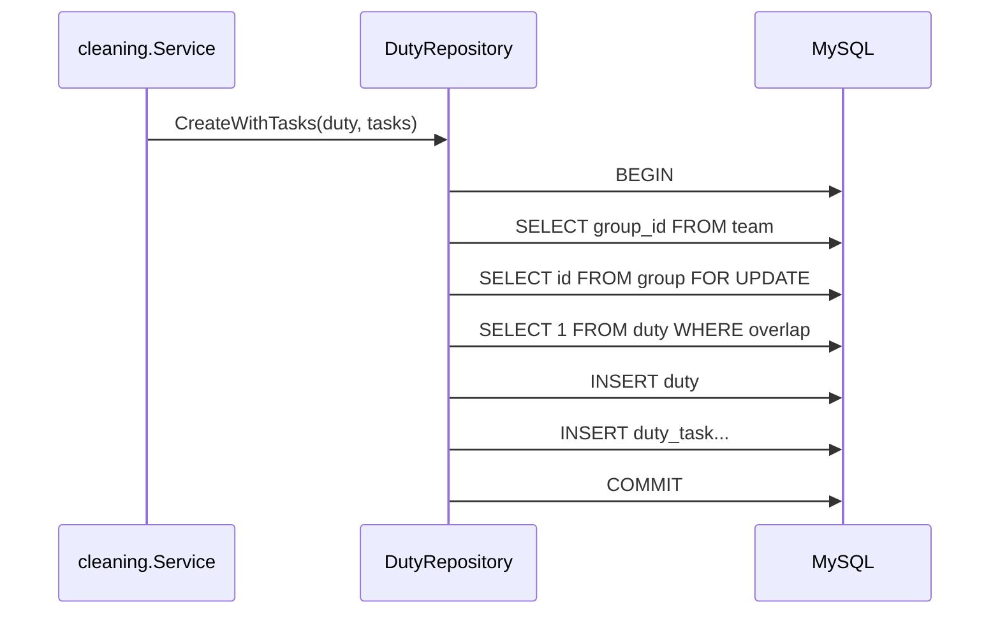

# Дежурства

## Назначение

`Duty` — недельное дежурство одной команды. Оно связывает:

- `group` через `duty.group_id`;
- конкретную дежурную `team`;
- фактический состав `duty_participants`;
- полуоткрытый период `[start_date, end_date)`;
- последовательный номер `sequence_number`;
- список `DutyTask`.

Основная реализация: `pkg/core/domain/duty`, `pkg/core/usecase/cleaning`, `pkg/core/usecase/resident`, `pkg/infrastructure/mysql/repository/duty.go`.

## Основные сущности

- `Duty`
- `DutyTask`
- `DutyTaskOverride`

## Инварианты

- внутри одной группы `sequence_number` уникален;
- внутри одного `duty` задача каталога может появиться только один раз;
- периоды двух `duty` одной группы не должны пересекаться;
- период трактуется как `[start, end)`;
- активность определяется по локальному времени приложения;
- история не снапшотит связанные `task/team/user`.

## Timezone

- scheduler и use-case используют `TZ` из env;
- HTTP helper `parseDutyPeriod` нормализует даты к `09:00` в этой timezone;
- типичный runtime timezone проекта — `Europe/Moscow`.

## `sequence_number`

`sequence_number` — это порядковый номер дежурства внутри группы.

Он нужен для:

- явного порядка истории;
- recurrence задач по sequence;
- устойчивой ротации и дедупликации создания дежурств.

Начальное значение для группы — `1`, далее номер увеличивается на 1 от `FindLatestByGroupID`.

## Формирование дежурства

`Team membership != Duty participation`.

При создании `Duty` в одной транзакции фиксируется snapshot текущих членов
назначенной команды в `duty_participants` с типом `REGULAR`; постоянный лидер
команды также добавляется, даже если он не числится обычным членом. Одновременно
`duty.leader_id` сохраняет фактического руководителя именно этого дежурства.

Далее состав не зависит от переводов между командами: жителя той же группы можно
добавить только в это дежурство как `TEMPORARY`, а исключение — soft-state
изменение `excluded_at`. Активные строки `duty_participants` являются источником
истины для participant task-access, нагрузки и duty-specific уведомлений.
Изменять состав участников разрешено только в полуоткрытом календарном периоде Duty.

### Автоматический weekly flow

`StartNewWeek`:

1. читает все группы;
2. подбирает команду для каждой группы;
3. создаёт `Duty` на период `now .. now+7d`;
4. распределяет территории и задачи;
5. сохраняет `duty` и `duty_task`;
6. очищает применённые overrides;
7. публикует `week.started`.

### Ручной flow

`StartNewDutyForGroup`:

- доступен только главе группы;
- принимает `start_date` и `end_date`;
- создаёт дежурство только для одной группы;
- использует тот же алгоритм ротации, recurrence и override.

## Выбор команды

Актуальный механизм опирается на `team.rotation_position`, а не на удалённый `group.next_duty_team`.

Алгоритм:

1. загрузить все команды группы;
2. отсортировать по `rotation_position`;
3. если предыдущего дежурства нет, взять первую команду;
4. если предыдущее дежурство есть, найти его `team_id` и выбрать следующую команду по кругу.

Если команда из последнего дежурства больше не входит в ротацию, создание нового дежурства для группы прерывается ошибкой.

## Распределение задач

Алгоритм `distributeTasks`:

1. групповые территории попадают только в duty своей группы;
2. общие территории (`area.group_id IS NULL`) раздаются между duty round-robin;
3. стартовый round-robin индекс = `CountDistinctStartDates() % len(duties)`;
4. по каждой задаче проверяется `TaskDefinition.IsScheduledFor(duty.SequenceNumber())`;
5. если есть `DutyTaskOverride`, он полностью переопределяет обычную recurrence;
6. due-задачи превращаются в `DutyTask`.

## Override-механизм

`duty_task_override` хранит только одноразовое решение для ближайшего включения:

- `include_in_next_duty = true` принудительно включает задачу;
- `false` принудительно исключает её;
- после успешного сохранения нового дежурства override удаляется.

Если сохранение `duty` не удалось, overrides не очищаются.

## Пересечение периодов

Создание `Duty` использует транзакцию и `SELECT ... FOR UPDATE` по строке `group`.

Полуоткрытый интервал означает:

- `future`: `start > now`
- `active`: `start <= now < end`
- `past`: `end <= now`

## Действия с прошедшим дежурством

Прошедшее дежурство не сразу становится read-only.

Фактическое правило:

- если дежурство прошлое, но в нём есть хотя бы одна задача без `verification_date`, команда всё ещё может взаимодействовать с ним;
- как только все задачи проверены, действия блокируются.

Это важно для late completion после формального окончания недели.

## Read-only режим

Resident view становится read-only, когда:

- пользователь не состоит в команде этого дежурства;
- дежурство будущее;
- дежурство прошлое и в нём не осталось незакрытых задач;
- пользователь смотрит history details, а не current-duty экран.

## Прогресс

История и current-duty UI считают:

- `total_cost_sum`
- `taken_cost_sum`
- `total_tasks_count`
- `taken_tasks_count`
- `completed_tasks_count`
- `verified_tasks_count`

Для resident view дополнительно считается:

- `cost_per_resident_goal`
- `my_taken_cost_sum`

Цель по баллам округляется вверх от общей суммы стоимости задач на число участников команды.

## История дежурств

История доступна только главе группы.

Источник — `DutyRepository.FindHistoryByGroupID`, который агрегирует прогресс SQL-запросом и сортирует по:

1. `start_date DESC`
2. `sequence_number DESC`
3. `id DESC`

### Последнее незавершённое прошлое дежурство

Если у жителя есть собственная команда и у неё осталось незавершённое прошлое дежурство, экран `/app/tasks` показывает именно его, даже если сейчас активна уже другая команда той же группы.

Это позволяет дочистить и дозакрыть задачи старой недели.

## Где реализовано

- домен: `pkg/core/domain/duty/*.go`
- создание и ротация: `pkg/core/usecase/cleaning/distribution.go`
- task actions: `pkg/core/usecase/cleaning/service.go`
- resident projection: `pkg/core/usecase/resident/service.go`
- транзакции и overlap: `pkg/infrastructure/mysql/repository/duty.go`
