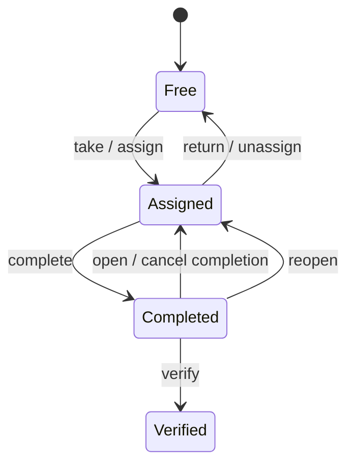

# Задачи

## Назначение

В проекте есть два уровня задачи:

- `TaskDefinition` — запись каталога задач;
- `DutyTask` — конкретный экземпляр задачи в рамках одного `Duty`.

## `TaskDefinition`

Поля:

- `id`
- `area_id`
- `title`
- `cost`
- `recurrence_interval`
- `start_sequence`

### Recurrence-модель

Актуальная модель sequence-based.

Допустимые значения `recurrence_interval` подтверждены кодом `catalog.IsValidRecurrenceInterval`:

- `0` — задача выключена из регулярного расписания, попадёт только через override;
- `1` — каждое дежурство;
- `2` — каждое второе;
- `4` — каждое четвёртое;
- `12` — каждое двенадцатое.

Задача считается due для `dutySequence`, если:

- `recurrence_interval > 0`;
- `dutySequence >= start_sequence`;
- `(dutySequence - start_sequence) % recurrence_interval == 0`.

Это заменило старую модель через количество дней и `frequency`.

### `start_sequence`

`start_sequence` определяет, с какого номера дежурства задача начинает участвовать в recurrence. Сейчас:

- в обычном group duty settings create flow новые задачи создаются со `start_sequence = 1`;
- при прямом CRUD каталога задач значение можно задавать явно через DTO и frontend формы.

### Стоимость

`cost` участвует в:

- прогрессе дежурства;
- цели на одного жителя;
- reminder-логике "users below assigned goal".

### Soft delete

Удаление `TaskDefinition` не удаляет запись физически:

- `task.deleted_at` заполняется `NOW()`;
- из текущего каталога задача исчезает;
- для активных `duty` связанные `duty_task` по этой задаче удаляются транзакционно.

Следствие: история старых дежурств может потерять стоимость и детали soft-deleted задачи, потому что history query джоинит текущую таблицу `task`.

## `DutyTask`

Поля:

- `task_id` каталога;
- `assignee_id`;
- `reviewer_id`;
- `assignment_date`;
- `completion_date`;
- `verification_date`.

## Состояния `DutyTask`

Фактическое вычисление статуса:

- `verified`, если есть `verification_date`
- иначе `completed`, если есть `completion_date`
- иначе `assigned`, если есть `assignee_id`
- иначе `free`

## Допустимые переходы

Методы домена:

- `CanAssign`
- `CanUnassign`
- `CanComplete`
- `CanCancelCompletion`
- `CanVerify`
- `CanReopen`

### Правила

- `assign` разрешён только если задача свободна;
- `return` и `complete` разрешены только текущему исполнителю;
- `open` (`CancelCompletion`) разрешён только текущему исполнителю и только до проверки;
- `verify` разрешён только если задача завершена и ещё не проверена;
- `reopen` для главы команды тоже работает только из состояния completed, до verification.

`verified` — терминальное состояние для домена `DutyTask`: после проверки нельзя отменить завершение без отдельного ручного изменения данных.

## Назначение и права

Use-case слой добавляет поверх доменных переходов ещё и контекстные ограничения:

- взаимодействовать можно только с duty своей команды;
- если duty прошлое, действия разрешены только пока есть outstanding tasks;
- подтверждать и переоткрывать может только `team.leader_id` команды, назначенной на это duty.

## Включение в `Duty`

`DutyTask` создаётся:

- автоматически при формировании дежурства, если задача due;
- вручную в duty settings, если новая задача создаётся с флагом включения в активное дежурство;
- через include/exclude операции duty settings для активного дежурства группы.

## Где реализовано

- каталог: `pkg/core/domain/catalog/task.go`
- экземпляр задачи: `pkg/core/domain/duty/dutytask.go`
- transitions в БД: `pkg/infrastructure/mysql/repository/dutytask.go`
- include/exclude и task editor: `pkg/core/usecase/dutysettings/service.go`
