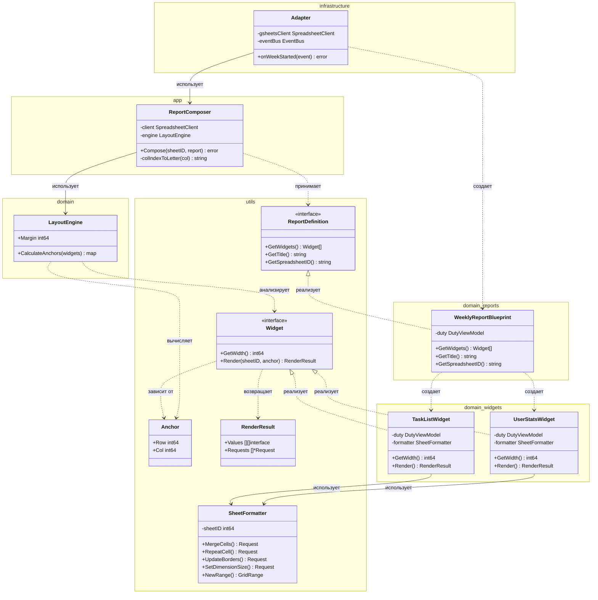

```mermaid
classDiagram
    direction TB

    %% Пакет Utils: Базовые типы и инструменты
    namespace utils {
        class Widget {
            <<interface>>
            +GetWidth() int64
            +Render(sheetID, anchor) RenderResult
        }
        class ReportDefinition {
            <<interface>>
            +GetWidgets() Widget[]
            +GetTitle() string
            +GetSpreadsheetID() string
        }
        class Anchor {
            +Row int64
            +Col int64
        }
        class RenderResult {
            +Values [][]interface
            +Requests []*Request
        }
        class SheetFormatter {
            -sheetID int64
            +MergeCells() Request
            +RepeatCell() Request
            +UpdateBorders() Request
            +SetDimensionSize() Request
            +NewRange() GridRange
        }
    }

    %% Пакет Domain/Widgets: Компоненты верстки
    namespace domain_widgets {
        class TaskListWidget {
            -duty DutyViewModel
            -formatter SheetFormatter
            +GetWidth() int64
            +Render() RenderResult
        }
        class UserStatsWidget {
            -duty DutyViewModel
            -formatter SheetFormatter
            +GetWidth() int64
            +Render() RenderResult
        }
    }

    %% Пакет Domain/Reports: Схемы отчетов
    namespace domain_reports {
        class WeeklyReportBlueprint {
            -duty DutyViewModel
            +GetWidgets() Widget[]
            +GetTitle() string
            +GetSpreadsheetID() string
        }
    }

    %% Пакет Domain: Алгоритмы размещения
    namespace domain {
        class LayoutEngine {
            +Margin int64
            +CalculateAnchors(widgets) map
        }
    }

    %% Пакет App: Координация процесса
    namespace app {
        class ReportComposer {
            -client SpreadsheetClient
            -engine LayoutEngine
            +Compose(sheetID, report) error
            -colIndexToLetter(col) string
        }
    }

    %% Пакет Infrastructure: Точка входа и связь с внешними системами
    namespace infrastructure {
        class Adapter {
            -gsheetsClient SpreadsheetClient
            -eventBus EventBus
            +onWeekStarted(event) error
        }
    }

    %% Реализация интерфейсов
    Widget <|.. TaskListWidget : реализует
    Widget <|.. UserStatsWidget : реализует
    ReportDefinition <|.. WeeklyReportBlueprint : реализует

    %% Зависимости (движение вниз к ядру)
    Adapter --> ReportComposer : использует
    Adapter ..> WeeklyReportBlueprint : создает
    
    ReportComposer --> LayoutEngine : использует
    ReportComposer ..> ReportDefinition : принимает
    
    WeeklyReportBlueprint ..> TaskListWidget : создает
    WeeklyReportBlueprint ..> UserStatsWidget : создает
    
    TaskListWidget --> SheetFormatter : использует
    UserStatsWidget --> SheetFormatter : использует
    
    %% Связи с базовыми типами
    Widget ..> Anchor : зависит от
    Widget ..> RenderResult : возвращает
    LayoutEngine ..> Anchor : вычисляет
    LayoutEngine ..> Widget : анализирует
```